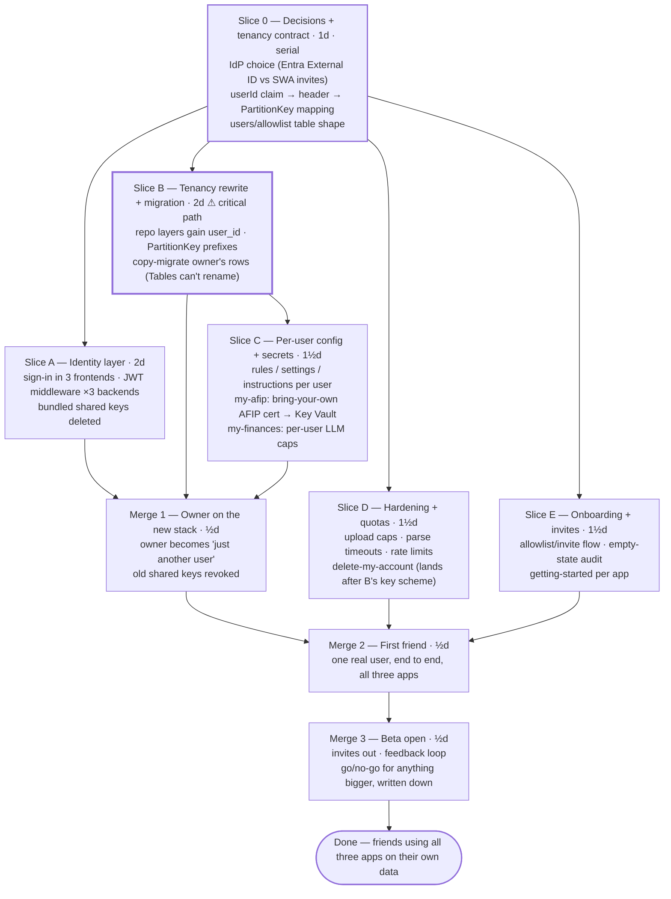

# ROADMAP — multiuser (friends beta)

Sequenced **after `ROADMAP.md` (family integration)** — at minimum after its Slice A (auth
hardening), whose single-user model this roadmap deliberately replaces. Scope decided 2026-07-30:
**invite-only friends beta (~tens of users), all three apps at once** — one shared identity and
tenancy layer instead of three migrations.

The structural problem is the same in all three apps: auth is "one owner behind a private page with
a shared key in the bundle", and every table assumes a single tenant. Multiuser therefore has two
real workstreams — **identity** (who is calling) and **tenancy** (whose rows are these) — and they
only meet at the end. They share nothing but the S0 contract, so they run in parallel; that is the
whole roadmap.

**Status (2026-07-30): not started — S0 decisions open.**

**Wall-clock:** critical path **S0 → B → C → M1 → M2 → M3 ≈ 6d**; A, D and E all fit inside that
window with a second lane (vs ~10–11d serial). Staff B first — everything user-shaped keys off its
partition scheme. A is the other long pole; it gets the second lane's first two days.

---

## Slice 0 — Decisions + tenancy contract (1 day, serial — everything waits on this)

**Owns:** dev-kit `docs/multiuser-contract.md` (new)

The freeze that buys the parallelism: A builds identity against this contract while B rewrites
storage against it, and they never need to meet before M1.

- [ ] **Decide the IdP.** The constraint data: SWA built-in auth caps custom-role *invitations at
      25 per app* — and it's per app, so each friend needs three invites and ~tens of users hits
      the cap; linked backends to kill the bundled key need SWA Standard (~$9/mo × 3 apps).
      **Leaning: Entra External ID** — one user tenant shared by all three apps, free tier far
      above beta scale, real JWTs the backends validate themselves, no SWA Standard needed.
      Record the rejection reasons either way
- [ ] **Freeze the tenancy contract:** `userId` = the IdP's stable subject claim; it prefixes
      **PartitionKey** in every table — `{userId}` where the partition was constant
      (my-expenses `transactions`/`rules`/`statements`, my-afip `orders`/`invoices`),
      `{userId}|{existing}` where it carried meaning (my-finances `{userId}|{brokerId}`).
      RowKeys unchanged — my-expenses' sha1 dedupe becomes per-user automatically
- [ ] **Freeze the middleware interface** per stack: token → validated claims → `user_id` as the
      first argument of every repo-layer function (FastAPI dependency for my-expenses; one shared
      Node middleware for the two Functions apps — it lives in dev-kit or `@amajail/*`, written
      once)
- [ ] **`users` / allowlist shape:** invited-email allowlist checked at first sign-in, `role`
      (`owner` | `member`), created-at — one table per app, same schema, per the contract

**Exit:** contract in dev-kit; A and B start from it without talking to each other.

## Slice A — Identity layer (2 days) — needs S0

**Owns:** the three frontends' auth wiring; new middleware in `my-expenses/backend/app/` (auth
dependency), `my-afip/src/`, `my-finances/src/` (or the shared dev-kit middleware both import);
each app's SWA/app config for the IdP

- [ ] Register the three apps in the chosen IdP; sign-in/sign-out in all three frontends
- [ ] Token validation middleware in all three backends per the S0 interface; requests without a
      valid token → 401, users not on the allowlist → 403
- [ ] **Delete every bundled shared key** — `PUBLIC_FUNCTION_KEY` ×2, `x-api-key` — frontend calls
      carry the user's token instead
- [ ] `role` enforcement: destructive/admin routes (`delete_all`, settings writes, process-month)
      require `owner` until C ships per-user scoping
- [ ] CI guard: the ship-guard pattern from my-expenses extended — a build whose bundle contains a
      key-shaped env var fails

**Exit:** all three APIs answer only to a valid signed-in user; no shared secret ships to any
browser.

## Slice B — Tenancy rewrite + migration (2 days ⚠ critical path) — needs S0

**Owns:** `my-expenses/backend/app/repository.py` + tests; `my-afip/src/database/` + tests;
`my-finances/src/infrastructure/repositories/` + `src/database/` + tests; one migration script per
repo (`scripts/migrate-multiuser.*`)

- [ ] Every repo-layer function takes `user_id` and scopes reads/writes to the S0 partition scheme —
      developed against a fake `user_id`, so no dependency on A
- [ ] Cross-user isolation tests per app: user X's queries return zero of user Y's rows — the test
      that makes tenancy a guarantee instead of a convention
- [ ] my-expenses: dedupe re-verified per-user (same statement uploaded by two users inserts twice,
      once each — §11.4 analogue); my-finances: all 8 tables covered, positions
      `{userId}|{brokerId}`; my-afip: orders 409-dedupe preserved under the new partition
- [ ] **Migration scripts** (Tables can't rename a PartitionKey): copy owner's rows to
      `{ownerUserId}…` partitions, verify counts, delete old partitions — idempotent, dry-run mode
      first

**Exit:** isolation tests green in all three repos; owner's data migrated on a scratch table
end-to-end.

## Slice C — Per-user config + secrets (1½ days) — needs B

**Owns:** my-expenses categorizer rules plumbing; my-finances settings/instructions/analysis
use-cases; my-afip credential handling (`src/` config + Key Vault wiring)

- [ ] my-expenses: user rules per user (defaults stay shared); re-categorization hooks scoped
- [ ] my-finances: settings, instructions doc + history, and weekly analyses keyed per user;
      **weekly analysis is opt-in per user with a per-user token/cost cap** — N users must not mean
      N× silent Friday LLM spend
- [ ] my-afip: **bring-your-own credentials** — each user uploads their own AFIP cert/key and CUIT
      (and Binance keys if they use the fetch); stored per user in Key Vault, never in app
      settings. The app files *their* taxes with *their* cert or it files nothing — the liability
      line that keeps my-afip in scope
- [ ] my-afip: users without credentials see the dashboard read-only-empty, not errors

**Exit:** two users hold different rules, different instructions, different certs — and each app
behaves per-user.

## Slice D — Hardening + quotas (1½ days) — needs S0 (delete-account item lands after B)

**Owns:** my-expenses upload route hardening + limits config; rate-limit middleware (shared, same
home as A's middleware); per-app quota checks; `DELETE /api/me` per app

- [ ] Statement upload: size cap, page cap, pdfplumber wall-clock timeout — friends' PDFs are
      untrusted input to a parser that was tuned on trusted ones
- [ ] Rate limits on upload and mutation routes; per-user row/storage quotas with a clear 429/403
      message
- [ ] **`DELETE /api/me`** in each app: drops the user's partitions and Key Vault secrets —
      trivial *because* of B's key scheme, which is half the reason for it
- [ ] Failure-path audit: errors never leak another user's data or the existence of other users

**Exit:** a hostile 200-page PDF, a rate-limit burst, and a full account deletion all behave as
specified.

## Slice E — Onboarding + invites (1½ days) — needs S0

**Owns:** invite/allowlist admin page (owner-only, per app or one shared), empty states across the
three frontends, per-app getting-started docs

- [ ] Owner can invite by email (writes the allowlist); invited user's first sign-in provisions
      their `users` row
- [ ] Empty-state audit: every page renders helpfully with zero data — new users start at zero in
      all three apps
- [ ] Getting-started per app: my-expenses "download your Ualá/Galicia statement, upload it here";
      my-afip credential setup walkthrough; my-finances broker/position setup

**Exit:** a new user goes from invite email to first populated page without the owner driving.

---

## Fan-in

### Merge 1 — Owner on the new stack (½ day) — needs A + B + C

- [ ] Run the real migration (B's scripts) on production data — after a table backup
- [ ] Owner signs in as a normal user; every existing feature works on migrated data
- [ ] Old shared keys revoked at the platform (not just removed from bundles)
- [ ] MCP servers re-verified: still owner-scoped, still working (they serve the owner's partition)

**Exit:** owner runs all three apps through the new auth on migrated data; no legacy path remains.

### Merge 2 — First friend (½ day) — needs M1 + D + E

- [ ] One real friend, end to end: invite → sign-in → their own statements/positions/orders
- [ ] Isolation spot-check on production: their data and the owner's never cross
- [ ] Fix what breaks; every fix lands with a test

**Exit:** one non-owner user active in all three apps on their own data.

### Merge 3 — Beta open (½ day) — needs M2

- [ ] Invites to the rest of the list (~tens); watch quotas, costs, error rates for a week
- [ ] Feedback loop: a lightweight channel and a triage habit
- [ ] Write the go/no-go: what "public product" would additionally require (billing, support,
      compliance) — decided deliberately, not drifted into

**Exit:** the beta is live, the next-step decision is on paper.

---

## Decisions made (2026-07-30)

1. **Audience → friends beta.** Household-only rejected: too small to force real tenancy, would be
   redone. Public rejected: billing, support and compliance obligations nobody asked for yet.
2. **All three apps at once**, owner's call — one identity migration instead of three; the shared
   middleware and one Entra tenant only pay off if everyone uses them.
3. **my-afip stays in scope only as bring-your-own-credentials.** Holding other people's AFIP
   certs provisioned by the owner was rejected as untenable liability; users supply their own or
   get a read-only shell.
4. **MCP stays owner-only in the beta.** The Functions MCP extension authenticates with an
   app-level system key — per-user MCP auth is real work with no beta user asking for it.

## Deliberately not building

- **Billing / subscriptions** — beta is free; billing is a go/no-go output of M3, not a slice.
- **Self-serve signup** — the allowlist *is* the product boundary; removing it is the public-tier
  decision.
- **Per-user MCP or per-user monthly-close routines** — the integration roadmap's routines keep
  reading the owner's partition only.
- **A second datastore** — tenancy is a PartitionKey prefix; Table Storage stays the only store.

## Standing assumptions (not blocking — flag if wrong)

- The integration roadmap's Slice A (single-user auth hardening) ships first — it's ½ day and
  closes a live hole; this roadmap then replaces its key-behind-private-page model entirely.
- Beta users are Argentine-bank users (Ualá/Galicia statements, AFIP monotributo, AR brokers) —
  the parsers and defaults don't need to generalize for the beta.
- ~Tens of users fits comfortably in the existing Azure footprint (Table Storage, one Container
  App, two Function Apps); no infra scaling slice is needed.
