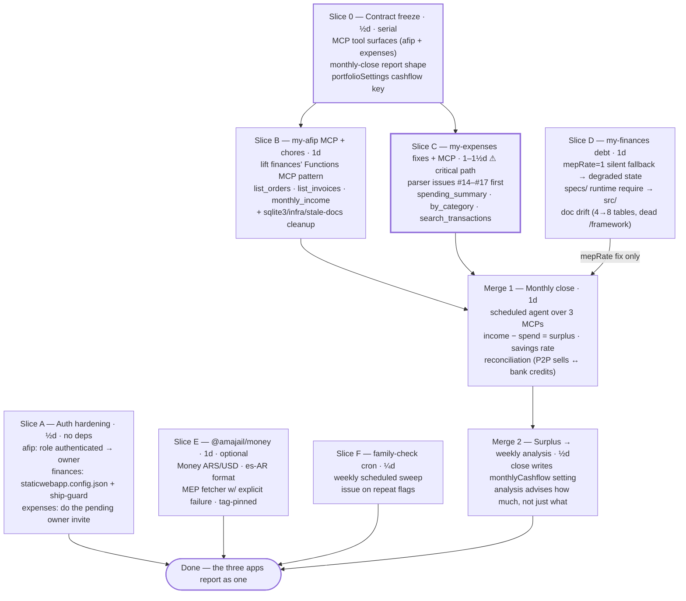

# ROADMAP — family integration (2026-07)

From the 2026-07-30 brainstorm. The three apps already form a complete triangle — **my-afip =
income**, **my-expenses = spending**, **my-finances = wealth** — but they don't talk to each other.
This roadmap makes Claude the integration layer (MCP everywhere, then cross-app routines) instead of
building a fourth aggregator app, which would violate the one-datastore rule and own a sync problem
forever.

Slice method per `/slice-roadmap`: Slice 0 freezes the shared contracts, each slice owns a disjoint
file set (here: disjoint *repos + files*, so parallel branches never collide), fan-in merges at the
end. Check items off as they land.

**Status (2026-07-30): S0 + A–D built and verified; PRs open awaiting owner merge** —
afip [#38](https://github.com/amajail/my-afip/pull/38) (auth) + [#39](https://github.com/amajail/my-afip/pull/39) (MCP),
finances [#55](https://github.com/amajail/my-finances.adrimajail.com/pull/55) (auth) + [#56](https://github.com/amajail/my-finances.adrimajail.com/pull/56) (debt),
expenses [#25](https://github.com/amajail/my-expenses/pull/25) (parsers+MCP), dev-kit [#6](https://github.com/amajail/dev-kit/pull/6) (contracts).
E, F, M1, M2 not started; M1 unblocks once B+C+D merge and deploy.

**Wall-clock:** critical path **S0 → C → M1 → M2 ≈ 3½–4d**; A, B, D, E, F all fit inside that window
with a second lane (vs ~6–7d serial). A has no dependencies and closes the only genuine security
hole — start it first regardless of lanes.

---

## Slice 0 — Contract freeze (½ day, serial — B, C, M1, M2 all wait on this)

**Owns:** dev-kit `docs/mcp-contracts.md` (new)

The integration analogue of my-expenses' frozen Pydantic ↔ api.ts contract: agree the tool surfaces
once so the two MCP slices and the monthly-close routine build against paper, not against each other.

- [x] my-afip MCP tools: `list_orders(month)`, `list_invoices(month)`, `monthly_income(month)` —
      names, arg/return schemas, error shape (copy my-finances' `{error, code, details}`)
- [x] my-expenses MCP tools: `spending_summary(month, kind?)`, `by_category(month, kind?)`,
      `search_transactions(query)` — read-only; `Card payment` exclusion holds (CLAUDE.md rule 2)
- [x] Monthly-close report shape: income, spend by category, surplus, savings rate,
      unreconciled list — the fields M1 must fill and M2 may consume
- [x] `portfolioSettings` key: `monthlyCashflow` = `{month, incomeArs, spendArs, surplusArs,
      computedAt}` — written by M1, read by M2

**Exit:** contracts written in dev-kit; every later slice cites them instead of negotiating.

## Slice A — Auth hardening (½ day, no deps — start immediately)

**Owns:** my-afip `dashboard/public/staticwebapp.config.json`; my-finances
`dashboard/public/staticwebapp.config.json` + workflow guards; my-expenses: portal only.

All three ship an API key in the browser bundle; the key is secret only while the page is private
(my-expenses ROADMAP decision #10 — learned the hard way). Today two of three pages aren't.

- [ ] my-afip: SWA role `authenticated` → custom `owner` + invite. `authenticated` admits **any**
      GitHub account to a page holding the function key for a tax-filing POST endpoint
- [ ] my-finances: add `staticwebapp.config.json` (owner role, GitHub IdP) — it has **none** — and
      port my-expenses' ship-guard (deploy + pr-checks fail if the config is missing from the build
      output; that exact failure already happened once in my-expenses)
- [ ] my-expenses: perform the pending `owner` invite — the app is locked until then

**Exit:** all three sites 403 anonymous and non-owner GitHub accounts; every bundled key sits behind
an owner-gated page.

## Slice B — my-afip MCP + chores (1 day) — needs S0

**Owns:** my-afip `src/functions/mcp.js` (new), `package.json`, `infra/`, `docs/roadmap/`

- [ ] Lift my-finances' in-process Functions MCP pattern (`src/functions/mcp.js`, Streamable HTTP,
      platform system key, DI use-cases)
- [ ] Read tools per S0 contract — **no write tools**; invoicing stays CLI/cron only
- [ ] Expose orders-table freshness (age of newest fetched order) so M1 can flag a stale local
      Binance fetch instead of silently under-reporting income
- [ ] Chores ride along: drop unused `sqlite3` dep, delete or populate empty `infra/`, mark
      `docs/roadmap/critical-improvements.md` superseded, fix dead doc links

**Exit:** Claude answers "income this month?" via MCP; freshness visible.

## Slice C — my-expenses parser fixes + MCP (1–1½ days ⚠ critical path) — needs S0 (MCP half only)

**Owns:** my-expenses `backend/app/services/parsers.py` (bug fixes), new MCP module, tests

- [ ] Issues **#14–#17** first — #14 (stale `prev_saldo`) and #15 (zero delta → expense) corrupt
      bank-mode data that the MCP would then serve as fact
- [ ] MCP endpoint over FastAPI per S0 contract, read-only, same `x-api-key` story as the REST API
- [ ] New parser behaviour ⇒ matching `make_samples.py` line + test, same commit (repo rule)

**Exit:** Claude answers "spending by category last month?" via MCP; the four bank-mode issues closed.

## Slice D — my-finances debt (1 day) — no deps, but M1 waits on the mepRate item

**Owns:** my-finances `GetPortfolioSummary.js`, `GenerateWeeklyAnalysis.js`, `CLAUDE.md`, `README.md`

- [ ] **`mepRate=1` silent fallback → explicit degraded state.** On provider failure the summary
      currently reports ARS:USD at 1:1 with no signal — into the UI *and* into the weekly analysis
      prompt. Carry `fxDegraded` on the summary; analysis caveats or refuses. M1 trusts these
      numbers, hence the dependency
- [ ] Move `specs/002-…/submit-analysis-tool.json` into `src/` — production must not require the
      spec tree to be deployed
- [ ] Doc drift: CLAUDE.md lists 4 tables, code has 8; README documents the dead `/framework` page

**Exit:** a MEP provider outage is visible everywhere the number is used, not silently 1:1.

## Slice E — `@amajail/money` (1 day, optional — schedule into slack)

**Owns:** new package — **dev-kit workspace** (owner decision, 2026-07-30)

- [ ] `Money` (ARS/USD), es-AR `Intl.NumberFormat` helpers, `YYYY-MM` month keys, MEP/dolarapi
      fetcher with an **explicit** failure state (no more silent 1:1)
- [ ] Pin by tag like `@amajail/ui` — never floating; `/family-check` already flags drift
- [ ] Adopt in the two Node backends + dashboards; the Python backend shares conventions only

**Exit:** tag-pinned in at least one consumer; second `Money` implementation deleted.

## Slice F — family-check cron (¼ day, no deps)

- [ ] Weekly scheduled run of `/family-check` (the skill's own "Later" section, built)
- [ ] Escalation: open an issue when the same flag fires two sweeps running

**Exit:** drift lands in an inbox without being asked for.

---

## Fan-in

### Merge 1 — Monthly close (1 day) — needs B + C + D's mepRate fix

**Owns:** scheduled-agent routine definition; no new app code, no new storage

- [ ] Scheduled agent, ~3rd of each month: income (afip MCP) + spend by category (expenses MCP) +
      portfolio delta (finances MCP)
- [ ] The number no single app can compute: **savings rate** — surplus vs what actually reached the
      portfolio
- [ ] Reconciliation, both directions: P2P sells with no matching bank credit (proceeds never
      landed); bank income with no matching invoice (monotributista safety net). Fuzzy date+amount
- [ ] Skip-or-caveat on degraded inputs: stale afip fetch (B's freshness), `fxDegraded` (D)
- [ ] Deliver as a report (artifact/notification); the only write is M2's settings key

**Exit:** first monthly report produced from live data, all three sources cited.

### Merge 2 — Surplus → weekly analysis (½ day) — needs M1

**Owns:** my-finances `GenerateWeeklyAnalysis.js` prompt assembly; M1's settings write

- [ ] Monthly close writes `monthlyCashflow` to `portfolioSettings` (audited path)
- [ ] Weekly analysis includes it: the rebalance advice says **how much** to deploy, not just what
- [ ] Staleness rule: a `monthlyCashflow` older than ~45 days is omitted, not reused

**Exit:** a weekly analysis cites last month's surplus in its sizing.

---

## Deliberately not building

- **A fourth aggregator app with its own storage** — every cross-app feature above reads the three
  existing APIs/MCPs at run time; no sync problem, one-datastore rule intact.
- **Write tools on the new MCPs** — my-afip files taxes and my-expenses ingests statements; both
  stay human-triggered. my-finances' audited writes remain the only MCP write surface.

## Decisions made (2026-07-30 build, S0+A–D)

- **All three SWAs had zero registered users** — not just my-expenses' pending invite. Three owner
  invites issued via `az staticwebapp users invite`; each must be accepted **before** its auth PR
  merges, or the deploy locks the owner out (7-day expiry: 2026-08-06).
- **fxDegraded nulls USD figures rather than computing on stale data** (no last-known-good rate is
  stored), and the weekly analysis **refuses** on a degraded summary — null `valueUsd` would corrupt
  its partitioning math; a caveat can't rescue that. Dashboard surfacing is finances #57.
- **afip `list_invoices` derives from the orders table** (`success === true`) — the `invoices` table
  lacks voucher numbers and amounts; orders are already the source of truth for `report`. Manual
  invoices fall back to order date (they store no invoice date).
- **Slice E lives in dev-kit** as a workspace package, not its own repo (owner, 2026-07-30).
- **expenses MCP pins `mcp==1.12.4`** — the newest that resolves against fastapi 0.115.6/pydantic
  2.10.5. Upgrading is a coordinated-bump slice of its own (expenses #26).

## Backlog (good, independent, not scheduled)

- my-expenses: **cuota projection** (committed future spending from instalment descriptions —
  uniquely-AR, the parse work is already done), recurring-expense detection from débito automático,
  Drive-MCP statement auto-ingestion
- my-finances: scorecard **outcome P&L** (did following the advice make money — the number that
  justifies the feature), what-if simulation, dashboard tests, decompose `GenerateWeeklyAnalysis`
- my-afip: Binance-fetch staleness *alert* (B only exposes the age; alerting is M1's caveat for now)
